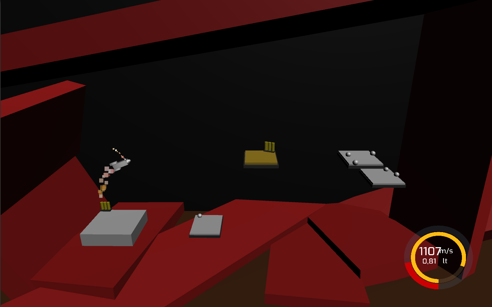
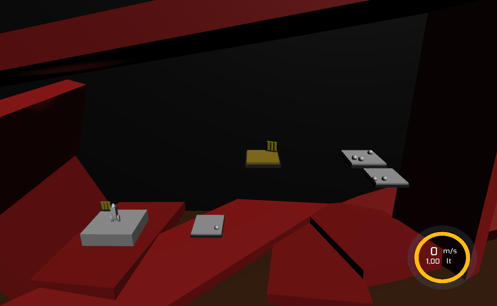

# Project-Boost

3D Game with Unity

In a short review, the missions is rescuing the circle astronouts who are on the platforms and getting back to launcher platform before facing with out of oil issue or crashing somewhere.

&nbsp;&nbsp;&nbsp;

